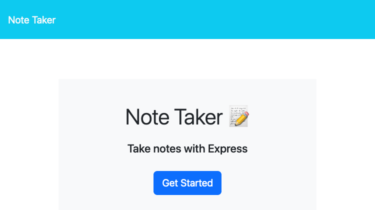
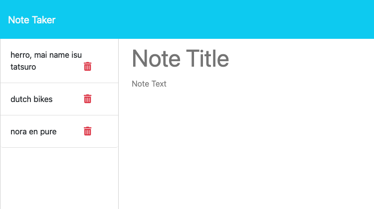

# Note Taker 
 
A fullstack web application that allows you to write and save notes to help with your productivity. Create notes with a title and description. They will persist until you decide to delete them.

Try it here: [https://noteru-takeru-543bba6b3767.herokuapp.com/](https://noteru-takeru-543bba6b3767.herokuapp.com/)
 
## Table Of Contents
1. [Installation](#installation)
2. [Usage](#usage)
3. [License](#license)
4. [Contributing](#contributing)
5. [Tests](#tests)
6. [Questions](#questions)
 
### Installation
 
For users, you can access the website here: [https://noteru-takeru-543bba6b3767.herokuapp.com](https://noteru-takeru-543bba6b3767.herokuapp.com/). For developers, make sure that you have Node v18.18.0 or greater installed. Then clone the repository. Inside the repository, do `npm install`. Once that is complete, you have successfully installed the application!
 
### Usage
 
For users, use the app here: [https://noteru-takeru-543bba6b3767.herokuapp.com/](https://noteru-takeru-543bba6b3767.herokuapp.com/). For developers, run `npm start`. The program will log a url link to the terminal so you can access the website locally for testing.

Start by writing the title of your new note. Next, add a description of your note under the title. Click on the `Save Note` button to save the note. You may now click on the note on the left side of the screen to view its contents. Lastly, you are able to delete a note by clicking it's `Delete` button; the list will update accordingly.
 
### License
 
 

This project in under the MIT license. Learn more about it here: https://opensource.org/licenses/MIT
 
### Contributing
 
When contribuing, using the same formatting when writing Javascript code. Write descriptive commits outlining the changes you have made to the app. Lastly, when making a pull request, ask to merge to the develop branch.
 
### Tests
 
No test instructions are available at this time.
 
### Questions
 
What is the link to my GitHub?
 
- Link to my GitHub profile: [https://github.com/elmfer](https://github.com/elmfer)
 
How can you contact me?
 
- Contact me through my email: [elmfer10@gmail.com](mailto:elmfer10@gmail.com)
